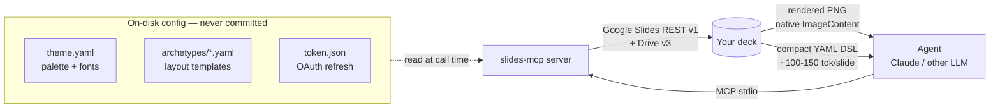
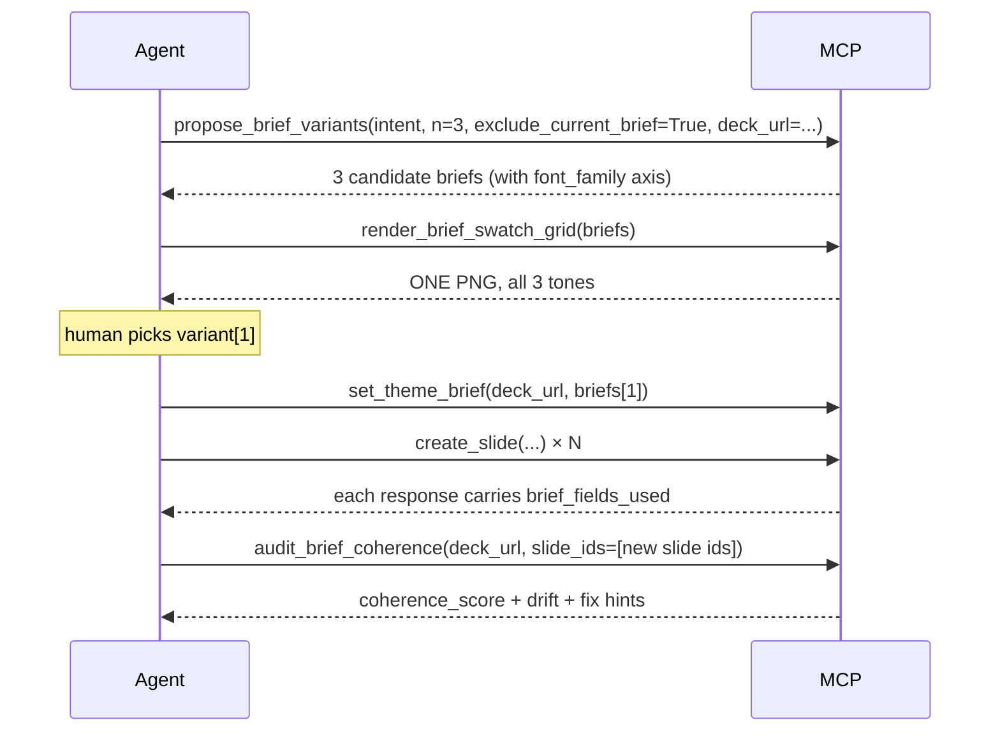
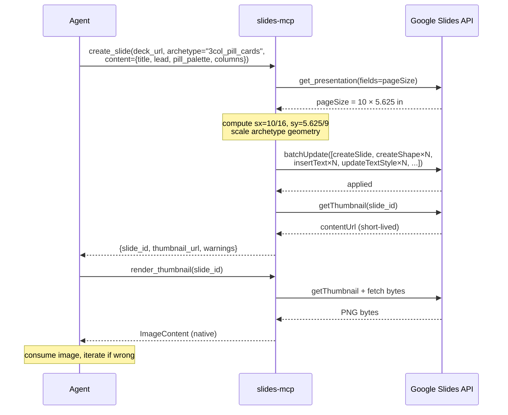
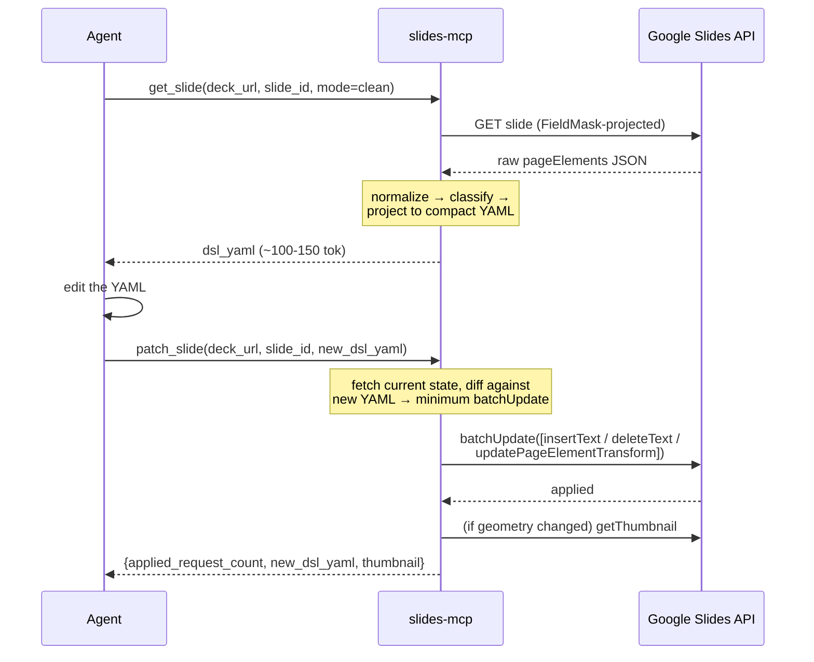
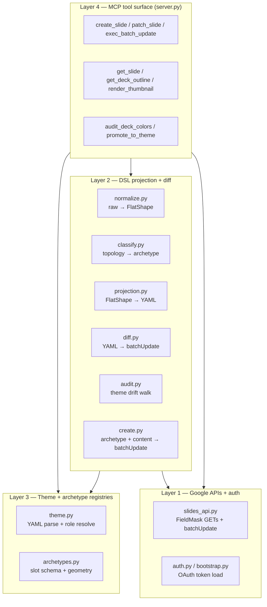

# slides-mcp

An MCP server that lets Claude (and other agents) turn prompts into finished Google Slides decks — and edit existing ones — through a compact YAML DSL. Built for multi-hundred-turn editing sessions without token bloat, with first-class brand-theme enforcement, presenter-note support, and a true bidirectional agent loop.

The agent can **see** rendered slides (native `ImageContent`), **edit** text + shape positions at coordinate level, **compose** new slides from archetype templates, **choose per-slide visual identity** via content-driven palettes, **commit a deck-level theme brief** (palette + fonts + shape language carried in a hidden meta-slide) that every subsequent `create_slide` resolves from, **preview** candidate themes and archetypes as PIL-composed PNGs *before writing any slide*, and **audit coherence** ("did this deck stick to its brief?") as a single closed-loop 0..1 score before shipping.

**Use cases this unlocks:**

- **Turn a README into a pitch deck** — one prompt in, ~10 slides out, with varied archetypes + content-driven palettes + presenter notes.
- **Repaint a brownfield deck** to new brand colors + fonts in one call (`restyle_slides(normalize_fonts=True)`).
- **Compare 3 theme variants before committing** — one PNG grid (`render_brief_swatch_grid`) instead of writing 15 slides.
- **Fresh-agent onboarding to an existing deck** — `orient_to_deck` returns brief + coherence + archetype histogram + dominant font + outline in one call.
- **Pre-ship coherence gate** — `audit_brief_coherence` gives one number plus per-slide fix hints.
- **Close the bidi loop** — the agent sees each rendered slide as native `ImageContent` and moves shapes via `elements[].at` DSL edits.

## Quick mental model



Core idea: **a slide is compressed into ~100-150 tokens of structured YAML keyed to (a) an archetype — what KIND of slide this is — and (b) a theme — what colors and fonts the brand uses.** The agent reasons in that compact space; the server translates to Google Slides `batchUpdate` requests.

## Why this exists

Thin JSON-passthrough Google Slides MCPs cost ~2 KB per edit (1 KB to read + 1 KB to write). A 100-turn editing session dies of token exhaustion. This server projects each slide into ~100-150 tokens and returns rendered thumbnails as native MCP `ImageContent` so the agent can visually verify in one call instead of fetching a URL.

## The three YAMLs (and one DSL)

### 1. `theme.yaml` — your brand

```yaml
name: mybrand
sub_themes:
  primary:
    palette:
      brand_accent:  "#3366CC"
      text_body:     "#333333"
      surface_card:  "#F3F3F3"
    fonts:
      display:      {family: "Inter", size_pt: 36, weight: 700}
      body:         {family: "Inter", size_pt: 18, weight: 400}
      pill_header:  {family: "Inter", size_pt: 22, weight: 600}
```

Palette keys are **roles**, not hex codes. DSL references `palette.brand_accent`; change the theme once and every slide follows. Multiple `sub_themes` let one brand carry multiple moods (e.g. `primary` vs `google_cobrand`).

**Where it lives (resolution order, first match wins):**

1. `$SLIDES_MCP_THEMES_DIR`
2. `$XDG_CONFIG_HOME/slides-mcp/themes` (default `~/.config/slides-mcp/themes`)
3. `./slides-mcp-themes` (project-local, add it to your own `.gitignore`)
4. Bundled `src/slides_mcp/themes/example.yaml` (fallback)

Your real brand theme stays outside the repo. The bundled `example.yaml` is a generic placeholder.

**Font overlay (v0.7.0):** the theme brief can additionally carry `font_family.{heading, body}` which overlays the theme YAML font family at build time — one commitment swaps the whole deck onto a curated Google Fonts pairing without touching the theme file. Browse curated pairings via `list_font_pairings(mood?)`.

### 2. `archetype.yaml` — what KIND of slide

```yaml
# 3col_pill_cards.yaml — three parallel ideas with colored pill headers
name: 3col_pill_cards
slots:
  required: [title, columns]
  optional: [lead]
  constraints: {columns_count: 3}

geometry_defaults:
  title:     {left_in: 0.9, top_in: 0.6, w_in: 14.4, h_in: 0.9, font_role: display}
  lead:      {left_in: 0.9, top_in: 1.8, w_in: 14.4, h_in: 1.5, font_role: body}
  column_1:  {left_in: 0.9,  top_in: 4.0, w_in: 4.6, h_in: 4.5}
  column_2:  {left_in: 5.7,  top_in: 4.0, w_in: 4.6, h_in: 4.5}
  column_3:  {left_in: 10.5, top_in: 4.0, w_in: 4.6, h_in: 4.5}
  pill:         {font_role: pill_header, color_role: brand_accent}
  title_accent: {h_in: 0.08, w_in: 2.4, top_offset_in: 1.0}
  column_dot:   {r_in: 0.15}
```

Archetypes describe layouts in **inches against a 16×9 reference deck**. The server **auto-scales at runtime** to your actual deck size (Google default is 10×5.625, legacy widescreen is 13.33×7.5 — all 16:9 aspect). Authors of new archetypes do not need to worry about deck-size variants.

Nine archetypes ship: `text_heavy_body`, `cover_with_hero`, `3col_pill_cards`, `4col_numbered_flow`, `4col_card_with_image`, `text_left_image_right`, `table_slide`, `logo_strip`, `generic_layout`. **Five have content builders** wired to `create_slide` in v0.3.0 (`text_heavy_body`, `cover_with_hero`, `3col_pill_cards`, `text_left_image_right`, `4col_numbered_flow` — see `supported_archetypes` in every `create_slide` response); the rest leave the slide blank and emit a warning for agent fallback to `create_shape` / `exec_batch_update`.

### 3. The DSL — how the agent reads and edits one slide

What `get_slide` returns (a `3col_pill_cards` slide, clean mode):

```yaml
id: sl_abc123
layout: 3col_pill_cards
mode: clean
title: Theme hygiene
lead: Brand drift is the default of a team deck. Surface it. Accept what belongs.
columns:
  - {pill: audit_deck_colors, body: "Walk every shape. Report off-theme colors..."}
  - {pill: promote_to_theme,  body: "Accept drift per role. Writes to user config..."}
  - {pill: Living theme,      body: "Theme is a doc, not a gatekeeper."}
notes: null
_object_ids: {title: t_title, paragraphs: [p_1, p_2]}
```

Edit this YAML, pass it back as `new_dsl_yaml` to `patch_slide`, and the server computes the minimum `batchUpdate` request list. Text edits, element moves, notes updates — one call.

**Clean mode** is the default, ~100-150 tok/slide. **Faithful mode** preserves raw per-element geometry for slides the classifier can't match to a known archetype.

## v0.7.0 — "Approve before you commit" (preview primitives)

v0.7.0 adds PIL-composed preview primitives that let a human eyeball theme / archetype candidates **before any slide is written**. Zero Slides API calls, zero deck writes; pure in-memory PNG composition returned as native MCP `ImageContent`.

| Tool | Purpose |
|------|---------|
| `render_brief_swatch(brief)` | One tone card: palette + pill row + numbered chips + shape chevron + font sample. |
| `render_brief_swatch_grid(briefs)` | N tone cards side-by-side in one PNG — the fast-switch approval primitive. |
| `preview_archetype(archetype, content, brief)` | PIL sketch of what a specific archetype+content+brief would render like. Compare layouts pre-commit. |
| `render_deck_contact_sheet(deck_url, slide_ids?, variant_id?, max_slides=36)` | Thumbnail grid PNG of every (or filtered) slide. Cuts N thumbnail round-trips to 1. |
| `list_font_pairings(mood?)` | Browse 12 curated Google Fonts pairings tagged by mood (editorial, tech, enterprise, bold, warm, elegant, …). |



## v0.7.0 — theme discipline (coherence + onboarding)

Three tools close the "did the deck stick to its brief?" loop:

| Tool | Purpose |
|------|---------|
| `audit_brief_coherence(deck_url, slide_ids?)` | Single composite 0..1 score (palette 50% + font 30% + shape 20%), slide-level drift report + fix hints. `slide_ids` scopes to a batch. |
| `orient_to_deck(deck_url, outline_limit=30)` | Composite fresh-agent onboarding: brief + coherence + archetype histogram + dominant font + (paginated) outline. Token-efficient on any deck size. |
| `create_slide.brief_fields_used` | New response field: list of brief paths each slide resolved from. Agent can assert observability in autonomous loops. |

See `skills/slides-mcp/rules/theme-discipline.md` for the prescriptive greenfield→brownfield→ship workflow.

## v0.6.0 — brownfield restyle + vanilla icons

| Tool | Purpose |
|------|---------|
| `audit_typography(deck_url)` | Brownfield typography audit — dominant font + outliers, size clusters, orphan bolds, color drift vs brief. |
| `restyle_slides(deck_url, slide_ids, normalize_fonts?, confirm_destructive)` | Retroactive brief apply — repaint fills + text colors + (v0.7.0) font families per brief. Destructive, gated by `confirm_destructive=True`. |
| `list_icons(filter_keyword?)` | Browse 30+ vanilla icons composed from Slides API native shapes (ROUND_RECTANGLE, RIGHT_ARROW, STAR_5, HEART, composed rectangles). |
| `create_icon(deck_url, slide_id, at, name, fill_hex?)` | Draw a vanilla icon. Auto-colors to brief.palette.accent if `fill_hex` omitted. No external SVG/raster deps. |

3col_pill_cards archetype accepts optional `icon_names: [str × 3]` to drop an icon above each pill.

## v0.5.0 — typographic depth + variant selection

| Tool | Purpose |
|------|---------|
| `update_text_style(slide_id, object_id, range, style)` | Character-range styling — bold/italic/color/size/fontFamily on `all` / `{paragraph}` / `{chars: [s,e]}` / `{match: "text"}`. |
| `update_paragraph_style(...)` | Paragraph-level: alignment, indent, lineSpacing, spaceAbove/Below. |
| `propose_brief_variants(intent, n, exclude_current_brief?)` | Propose N distinct-mood briefs (each carries font_family). |
| `generate_variants(deck, content_list, briefs, variant_prefix)` | Render same content under N briefs side-by-side. |
| `lock_variant(winner_id, manifest)` | Commit winner's brief + delete losers. |

## Plus one more: the theme brief (v0.3.0)

The theme + archetype + DSL trio covers *per-slide* identity. The theme brief covers *deck-level* coherence.

A brief is persisted as a **hidden meta-slide inside the deck** (`isSkipped=True`, title `__SLIDES_MCP_THEME_BRIEF__ — DO NOT DELETE`, body carries the YAML). The agent commits it once per deck from the user's intent; every subsequent `create_slide` call resolves unset visual fields from the brief.

```yaml
version: 1
palette:
  surface: "#0F1A4A"          # header bars, backgrounds
  accent:  "#E8612E"          # titles, dividers, highlights
  text:    "#000000"          # body text
  category_set:               # 3-5 hex for N-slot archetypes (pill cards, columns)
    - "#E8612E"
    - "#0F1A4A"
    - "#5A6B9A"
shape_language: "sharp"       # sharp | rounded | mixed
numbering_style: "bold"       # bold | outlined | dot | hidden
tone: "clean editorial"       # free-text — informs image prompts + copy register
image_prompt_style: "documentary photography, warm light"  # free-text
```

**Resolution order in every `create_slide`:** `per_slide_content > brief.palette.* > theme YAML > safety default`. Per-slide overrides still win (Decision O preserved); the brief is a *default*, not a gatekeeper.

Four tools — `get_theme_brief`, `set_theme_brief`, `update_theme_brief` (forward-only patch), and `extract_theme_brief` (brownfield audit: propose a brief from an existing deck's dominant palette + shape topology before committing). See `skills/slides-mcp/rules/theme-coherence.md` for the greenfield / brownfield / amendment workflows.

## Core flow — creating a slide from intent



The agent passes **semantic content** (title / lead / per-column pill + body) plus optional **visual intent** (`pill_palette`, `title_accent_hex`, per-column `pill_hex`). The server resolves geometry against the actual deck size and emits a single batched `batchUpdate`.

## Core flow — editing an existing slide



## Full tool surface (40 tools, v0.7.0)

### Write / compose

| Tool | What |
|------|------|
| `create_slide(deck_url, archetype, content, theme_brief?, ...)` | Compose a new slide from archetype + content. Pass `pill_palette` or per-column `pill_hex` for per-slide overrides. `theme_brief=True` (default) auto-reads the deck's meta-slide brief for unset fields. Response includes `brief_applied: bool`. |
| `create_image(deck_url, slide_id, at, url?, prompt?, caption?)` | Insert a raster (via `url`) OR a RECTANGLE placeholder with `[IMAGE: prompt]` text (via `prompt`) — the placeholder is a first-class deliverable, fill in later. |
| `patch_slide(deck_url, slide_id, new_dsl_yaml, ...)` | Apply a DSL diff — text edits + element translations, one call. |
| `create_shape(deck_url, slide_id, at, shape_type, ...)` | Insert a single shape surgically (when `create_slide` is too coarse). |
| `duplicate_slot(deck_url, slide_id, source_id, translate_in)` | Duplicate-and-offset an existing element. |
| `delete_slide(deck_url, slide_id)` | Intent-explicit single-slide deletion — collapses the 3-call escape-hatch pattern. |
| `exec_batch_update(deck_url, requests, confirm_destructive?)` | Raw `batchUpdate` escape hatch. `confirm_destructive=True` required for any `deleteObject` / `deleteSlide` / `replaceAllText`. |
| `clone_deck(src_url, new_title, replacements?)` | Copy a deck via Drive with optional find/replace map. |

### Read

| Tool | What |
|------|------|
| `get_deck_outline(deck_url)` | Whole-deck index, ~40 tok/slide — one call for deck-level reasoning. |
| `get_slide(deck_url, slide_id, mode?, include_elements?)` | One slide as DSL. `include_elements=True` opts into the geometry channel for shape moves. |
| `search_deck(deck_url, query)` | Substring search across slide title + body text. |
| `list_slides_by(deck_url, filters)` | Structural grep — filter slides by archetype, has-image, etc. |
| `render_thumbnail(deck_url, slide_id, size?)` | Rendered PNG as native `ImageContent`. |
| `render_thumbnail_url(deck_url, slide_id, size?)` | Same, but returns URL only (no bytes). |
| `list_themes()` / `list_archetypes()` / `list_deck_layouts(deck_url)` | Registry + deck inventory. |

### Theme hygiene

| Tool | What |
|------|------|
| `audit_deck_colors(deck_url, theme?, sub_theme?)` | Walk every shape; report colors and fonts not in the active theme, with nearest-role suggestions. |
| `promote_to_theme(theme, sub_theme, role_name, kind, value)` | Write a drift value into the user theme file under a named role. |

### Theme coherence (v0.3.0) — in-deck brief

| Tool | What |
|------|------|
| `get_theme_brief(deck_url)` | Read the deck's active brief from its hidden meta-slide. Returns `{brief, slide_id, status}` or `status: "absent"`. |
| `set_theme_brief(deck_url, brief)` | Create or replace the brief. Appends a hidden `isSkipped` meta-slide titled `__SLIDES_MCP_THEME_BRIEF__ — DO NOT DELETE`. |
| `update_theme_brief(deck_url, changes)` | Forward-only deep-merge patch — future slides pick up the change, existing slides untouched. |
| `extract_theme_brief(deck_url)` | Brownfield: propose a brief from an existing deck's dominant palette + shape topology. Does NOT commit — agent reviews with user, tweaks, commits via `set_theme_brief`. |

### Brownfield + coherence (v0.6.0 / v0.7.0)

| Tool | What |
|------|------|
| `audit_typography(deck_url, theme?, sub_theme?)` | Font outliers, size clusters, orphan bolds, color drift vs brief. |
| `restyle_slides(deck_url, slide_ids, brief_overrides?, normalize_fonts?, confirm_destructive=True)` | Retroactive brief apply — fills + text colors + (v0.7.0) font families. |
| `audit_brief_coherence(deck_url, slide_ids?)` | Single 0..1 closed-loop score + drift + fix hints. |
| `orient_to_deck(deck_url, outline_limit=30)` | Composite fresh-agent onboarding. |
| `list_icons(filter_keyword?)` / `create_icon(...)` | Vanilla icons from Slides API native shapes. |

### Preview primitives (v0.7.0)

| Tool | What |
|------|------|
| `render_brief_swatch(brief)` | One tone-card PNG. |
| `render_brief_swatch_grid(briefs)` | N tone-cards in one PNG. |
| `preview_archetype(archetype, content, brief?)` | PIL dry-run of a candidate slide. |
| `render_deck_contact_sheet(deck_url, slide_ids?, variant_id?, max_slides=36)` | Whole-deck thumbnail grid. |
| `list_font_pairings(mood?)` | 12 curated Google Fonts pairings. |

### Typographic depth + variant selection (v0.5.0)

| Tool | What |
|------|------|
| `update_text_style(...)` / `update_paragraph_style(...)` | Range-based character / paragraph styling. |
| `propose_brief_variants(intent, n, exclude_current_brief?, deck_url?)` | N distinct-mood briefs (fonts included). |
| `generate_variants(deck, content_list, briefs, variant_prefix)` | Render content N ways. |
| `lock_variant(winner_id, manifest)` | Commit winner + delete losers. |

### Diagnostic

| Tool | What |
|------|------|
| `auth_status()` | Token path, scopes, expiry — no secrets. |

## What it does NOT (yet)

- **Resize / rotate** elements (warn-only in diff; translation-only writes since v0.2.1)
- **Archetype swap** ("relayout to 3 columns" — requires delete-all + recreate; reachable via `exec_batch_update`)
- **AI / stock image pipeline** (still vetoed by project vision; placeholder-with-prompt is the first-class deliverable)
- **Bundled Google Fonts TTFs** (`render_brief_swatch` falls back to DejaVu Sans/Serif when the brief-specified font isn't on the render host; font family name is still annotated on the swatch caption)
- **Clean projectors for `4col_numbered_flow` + `4col_card_with_image`** (restyle falls back to faithful walk)
- **`text_left_image_right` icon_name overlay** (only `3col_pill_cards` integrates `icon_names` for v0.6.0+)
- **`.pptx` target** (Google Slides only)
- **Master-slide / shared-layout mutations** (not scoped yet)

## Installation

Requires Python 3.11+ and [uv](https://docs.astral.sh/uv/).

```bash
# Install and drop the Claude Code skill (recommended)
uvx slides-mcp@latest install

# OR clone + run locally
git clone https://github.com/luutuankiet/slides-mcp.git
cd slides-mcp
uv sync
```

## Auth setup (one-time)

The MCP uses user-OAuth to talk to Google Slides. You need a Google Cloud project with Slides + Drive APIs enabled and a Desktop OAuth client.

1. Create a Google Cloud project; enable `slides.googleapis.com` and `drive.googleapis.com`
2. Create an OAuth 2.0 client (type: **Desktop app**), download `client_secret.json`
3. On any machine with a browser:

    ```bash
    uv run slides-mcp-auth --client-secret /path/to/client_secret.json --out ./token.json
    ```

    This opens a browser, you consent, `token.json` is written. The refresh token inside is long-lived.

4. If your MCP server runs headless, copy `token.json` over (`scp token.json devbox:~/.config/slides-mcp/token.json`). Point the server at it via `$SLIDES_MCP_TOKEN_PATH`.

## MCP client configuration

```json
{
  "mcpServers": {
    "slides": {
      "command": "uv",
      "args": ["run", "--directory", "/path/to/slides-mcp", "slides-mcp"],
      "env": {
        "SLIDES_MCP_TOKEN_PATH": "/home/me/.config/slides-mcp/token.json",
        "SLIDES_MCP_THEMES_DIR": "/home/me/.config/slides-mcp/themes"
      }
    }
  }
}
```

| env var | purpose | default |
|---------|---------|---------|
| `SLIDES_MCP_TOKEN_PATH` | Absolute path to `token.json` (OAuth) | `./token.json` |
| `SLIDES_MCP_THEMES_DIR` | Folder with your theme YAML files | — (falls through resolution order) |
| `XDG_CONFIG_HOME` | Standard XDG config root | `~/.config` |

## Architecture

Four layers — see `src/slides_mcp/server.py` for the MCP surface, `projection.py` for the compression core, `create.py` for archetype-to-requests composition.



## Status

**v0.7.0** — 40 MCP tools, 5 content builders + archetype preview dry-run, font axis in the brief, closed-loop coherence audit, composite fresh-agent onboarding, PIL-backed approve-before-commit primitives, brownfield font+palette repaint parity. **485 unit tests pass, ruff clean.** Live-verified on real decks (bidi loop + cross-archetype brief coherence + whole-deck contact-sheet gate + Round-6 autonomous intern PASSED). Pre-v1, actively iterated. Use at your own risk, expect rough edges. See `releases/` for per-version narratives.

### Version history (condensed)

| Version | Headline |
|---------|----------|
| **v0.7.0** | Approve before you commit: PIL swatch + contact sheet + archetype preview + font axis + closed-loop coherence + orient_to_deck. |
| v0.6.0 | Brownfield restyle (audit_typography + restyle_slides) + vanilla icons. |
| v0.5.0 | Typographic depth (update_text_style + update_paragraph_style) + variant selection (propose→generate→lock). |
| v0.4.1 | DX patch: skill package install refresh + bridge-slide anti-pattern. |
| v0.3.0 | Cross-slide theme coherence via in-deck meta-slide brief + brownfield extraction. |
| v0.2.1 | create_slide runtime deck-dim scaling + content-driven palette. |
| v0.2.0 | uvx install CLI + Claude Code skill package. |
| v0.1.x | Bidi loop (render_thumbnail ImageContent + translation writes) + compact YAML DSL. |

## Contributing

Issues welcome. PRs should include tests — `uv run pytest tests/unit/` runs in under a second and uses mocked Slides API JSON fixtures (no network).

## License

MIT. See [LICENSE](LICENSE).
