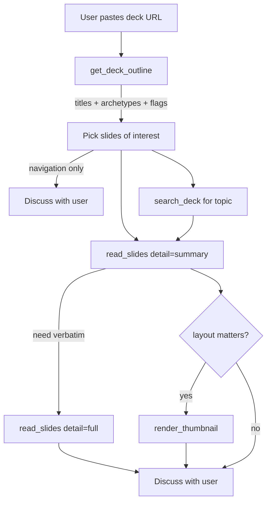

# slides-mcp v2

A minimal MCP server for ingesting Google Slides decks as agent context. Five read-only tools, token-efficient, mirrors `read_files` philosophy.

## What this is

You give Claude a Google Slides URL. Claude reads the deck (outline → drill-down → text or visual on demand) and discusses the content with you. No editing, no archetypes, no theme magic — pure read.

v2 is intentionally barebone: **be a great reader of slides, period.** The use case is conversation: paste a deck link, talk about it.

## Why v2 dropped writes

v0.x → v0.11 chased an ambitious write surface for Google Slides — archetypes, themes, briefs, restyle, plan_deck, theme_swap, exec_batch_update. After many sessions iterating against the live API on real decks, the conclusion was that brownfield slide editing via the Slides API is a losing game (autofit regressions, color drift, archetype mismatches, unpredictable rejects). The investment is sunk cost.

If you depended on the v0.x write tools: pin them — `uvx slides-mcp@0.11.0`.

## Tool surface

| Tool | Purpose |
|------|---------|
| `auth_status()` | Token state without exposing secrets |
| `get_deck_outline(deck_url)` | ~20 tok/slide whole-deck index — first call on every new deck |
| `read_slides(deck_url, slides?, detail?, include_notes?, include_images?)` | Read one or many slides at chosen detail |
| `search_deck(deck_url, query, slides?, regex?, include_notes?)` | Substring or regex search across deck |
| `render_thumbnail(deck_url, slide_id, size?)` | One slide as native PNG (`ImageContent`) |

## Detail modes

`read_slides` mirrors `read_files`: one tool, multi-mode, batched. Pick the cheapest detail level that answers the question.

| Mode | Per-slide tok | Returns |
|------|--------------|---------|
| `outline` | ~30 | title + archetype + element_count + has_notes/has_image flags + position + hidden + layout_id + notes_chars |
| `summary` | ~150 | title + joined body (cap 1500) + image_count + **full notes (no truncation)** + notes_chars + position/hidden/layout_id |
| `full` | ~300 | title + every body string (no cap) + image refs + table/chart counts + **full notes** + position/hidden/layout_id |
| `raw` | ~600 | every leaf shape with geometry + style + runs + full notes (debug; faithful) |

**Notes are content, not metadata.** Speaker notes are emitted verbatim in `summary`/`full`/`raw` so agents can read drafts where the narrative lives in notes (common case for working decks). The token budget reflects this — pay it; it's the difference between "reading the deck" and "reading the slide chrome".

**Hidden slides** (`slideProperties.isSkipped`) are flagged via `hidden: true` on every mode. Position is 1-indexed deck order. `layout_id` carries the source layout's `objectId` for grouping by template.

## Slide selectors

Mirrors the `read_files` per-file flexibility:

```
slides=None              # all slides (default)
slides="slide_id"        # single slide
slides="3-7"             # 1-indexed inclusive range
slides=["id1","id2"]     # list of object_ids
slides=[1,3,5]           # list of 1-indexed positions
slides={"first":5}       # head
slides={"last":3}        # tail
slides={"with_notes":true}
slides={"with_image":true}
slides={"hidden":true}    # only skipped slides
slides={"hidden":false}   # only visible slides
```

## Workflow



## Architecture

```
┌──────────────────────────────────────────┐
│ server.py — 5 FastMCP tools              │
├──────────────────────────────────────────┤
│ projection.py — outline/summary/full/raw │
│   per-slide dict with token-budget tiers │
├──────────────────────────────────────────┤
│ classify.py — archetype label            │
│   topology-derived diagnostic            │
├──────────────────────────────────────────┤
│ normalize.py — pageElement → FlatShape   │
├──────────────────────────────────────────┤
│ slides_api.py — REST wrapper             │
│   read-only: get + thumbnail             │
├──────────────────────────────────────────┤
│ auth.py — token.json refresh             │
└──────────────────────────────────────────┘
```

## Installation

Requires Python 3.11+ and [uv](https://docs.astral.sh/uv/).

```bash
uvx slides-mcp@latest
```

## Auth setup (one-time)

1. On a machine with a browser, drop a Google Cloud OAuth client JSON at `~/.config/slides-mcp/client_secret.json`. Configure the OAuth consent screen with scope `https://www.googleapis.com/auth/presentations.readonly` (v2 is strict read-only — no Drive scope, no write scope).
2. Run `slides-mcp-auth --client-secret ~/.config/slides-mcp/client_secret.json --out ~/.config/slides-mcp/token.json` and complete the consent flow.
3. Token lands at the canonical `~/.config/slides-mcp/token.json` path.
4. Copy the token to your headless host if running there: `scp ~/.config/slides-mcp/token.json host:~/.config/slides-mcp/`.

> ⚠️ **Don't use `--out ./token.json`.** That writes to your CWD, not the canonical path the server reads from. The server falls back to `~/.config/slides-mcp/token.json` (or `SLIDES_MCP_TOKEN_PATH` if set) — a token in your project directory will be silently ignored on next start. Always pass an absolute path.

The server reads `SLIDES_MCP_TOKEN_PATH` env if set, otherwise falls back to the default location.

## MCP client config

```json
{
  "mcpServers": {
    "slides-mcp": {
      "command": "uvx",
      "args": ["slides-mcp@latest"],
      "env": {
        "SLIDES_MCP_TOKEN_PATH": "/home/you/.config/slides-mcp/token.json"
      }
    }
  }
}
```

The server runs over stdio and auto-refreshes the OAuth token in-process.

## Token budget guidance

For a 50-slide deck:

| Operation | Approx cost |
|-----------|-------------|
| `get_deck_outline` whole deck | ~1000 tok |
| `read_slides(detail="summary")` whole deck | ~4000 tok |
| `read_slides(detail="full")` whole deck | ~7500 tok |
| `read_slides(detail="raw")` whole deck | ~20000 tok |
| One MEDIUM thumbnail | ~1300 tok |

Don't pull `full` on every slide. Start with outline, drill into the 5–10 slides that matter.

## Anti-patterns

- ❌ Calling `read_slides(detail="full")` with no slide selector on first contact — wastes tokens. Outline first.
- ❌ Calling `render_thumbnail` for every slide "just to see what they look like." Pick 1–3 with genuine visual interest.
- ❌ Using `detail="raw"` for content reasoning. It's geometry/style for debugging only — text is cleaner in `full`.
- ❌ Asking the server to edit a slide. v2 cannot. Tell the user, or pin `uvx slides-mcp@0.11.0`.

## Status

v2.0.1 — released April 2026. Patch over v2.0.0: OAuth refresh `invalid_scope` fix + slide metadata expansion (position, hidden, layout_id, notes_chars) + notes-verbosity (full notes verbatim in summary/full/raw, no truncation). Breaking surface still v2.0.0: all write tools removed.

## Troubleshooting

### `invalid_scope: Bad Request` on first tool call

**Symptom:** any tool call (except `auth_status`) errors with:
```
('invalid_scope: Bad Request', {'error': 'invalid_scope', 'error_description': 'Bad Request'})
```

**Cause:** v2.0.0 had a bug where token-refresh forced the narrow `presentations.readonly` scope onto the credential, which Google rejects when the token was minted under a different (broader) grant. Fixed in v2.0.1.

**Fix:** upgrade to v2.0.1 (`uvx slides-mcp@latest`). No re-auth needed; existing tokens keep working.

### Server says "no token at `~/.config/slides-mcp/token.json`"

You likely ran `slides-mcp-auth --out ./token.json` and the file landed in your project CWD. Move it to the canonical path:
```bash
mkdir -p ~/.config/slides-mcp
mv ./token.json ~/.config/slides-mcp/token.json
chmod 600 ~/.config/slides-mcp/token.json
```
Or set `SLIDES_MCP_TOKEN_PATH` to wherever it actually lives.

### Notes are huge — can I cap them?

No, by design. v2.0.1 emits full notes verbatim in `summary`/`full`/`raw` because notes are where the deck's narrative lives in working drafts. If you need to bound cost, narrow the `slides` selector (range, `with_notes`, `hidden:false`) instead of trimming each slide. `outline` mode skips note bodies entirely (only `notes_chars`).

## License

MIT.
