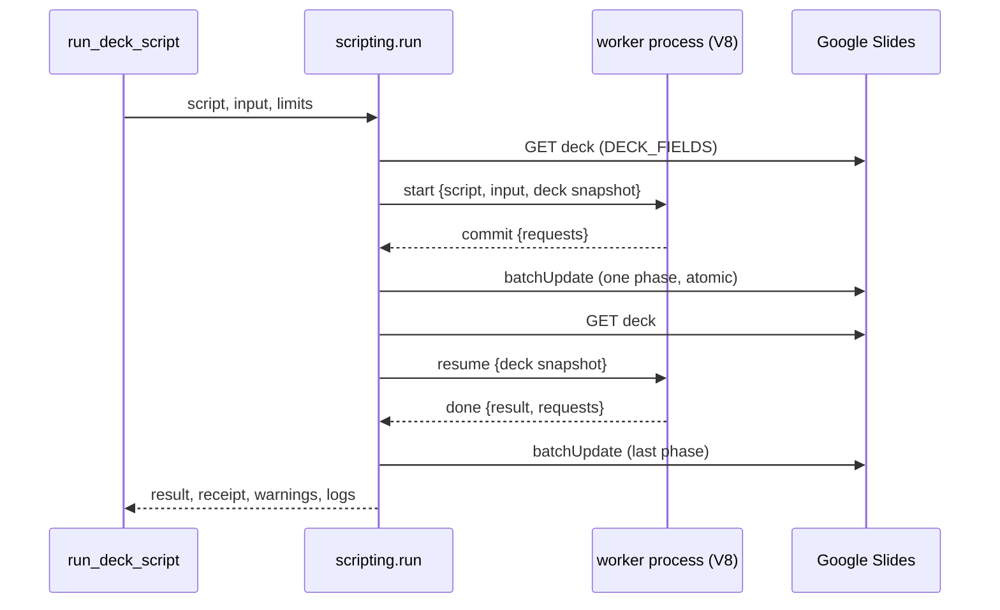

# Deck scripts

`run_deck_script` (`src/slides_mcp/server.py:823–950`) runs an agent's
JavaScript against one deck. The script reads the deck, computes, and queues
Slides API requests with `emit()`; the server applies them. The deck never
passes through the agent's context, only the script's return value does.

Line numbers are a starting point, not an address.

## The pieces

| file | role |
|---|---|
| `src/slides_mcp/scripting.py` | limits, the `Worker` handle, `run()` (391–), warnings, dry-run summary, notes expansion |
| `src/slides_mcp/sandbox/worker.py` | the child process: one V8 isolate per call, JSON lines on stdin/stdout |
| `src/slides_mcp/sandbox/prelude.js` | everything the script sees besides the deck: `emit`, `commit`, helpers, selectors, `console` capture |
| `src/slides_mcp/deck_model.py` | `build()` turns the API deck into the snapshot the script reads; `id_index()` maps every object id to its slide |
| `src/slides_mcp/writes.py` | `apply_batch`, destructive kinds, `unknown_ids`, `affected_slide_ids` |

## Why a separate process

The isolate is mini-racer (embedded V8). It runs in a child process spawned
per call (`python -m slides_mcp.sandbox.worker`), and the parent owns every
timeout:

- `cpu_timeout_s` is the budget for each wait on the worker, so an infinite
  loop between commits is killed. `timeout_s` is the overall wall clock,
  including API calls and thumbnails.
- When either fires, the parent kills the process. That is the only reliable
  stop: code after an `await` runs as V8 microtasks, which mini-racer's
  per-eval timeout does not cover.
- A V8 crash or out-of-memory (limit 1 GB) ends the child, not the MCP
  server.

The trade-off, recorded in `docs/adr/0004-deck-scripts-in-embedded-v8.md`, is
about 0.1 s of process start per call.

## What the script sees

`deck_model.build` (71–108) produces plain JSON: deck `{id, title,
revisionId, pageSize, slides}`, each slide with `position`, `hidden`,
`layoutId`, resolved `background` with `luminance`, `isDark` (luminance under
0.4), the resolved `theme` colours, `notes {objectId, text, markdown}` and
`elements`. Elements carry page-space EMU geometry (`x, y, w, h`, rotation and
groups already applied) plus the raw local `transform` and `parentMatrix`,
because write requests for a group child are in the parent's space.
Everything comes from `normalize.py`; see `read-path.md` for how fills,
theme colours and UTF-16 offsets are resolved.

The prelude wraps that JSON with selectors (`deck.select`, `deck.slide`,
`slide.find`, `deck.element`, `deck.slideOf`) and helpers that return request
dicts. `styleRuns` keeps each run's weight when the font changes, since
setting `fontFamily` alone resets weight to 400. `textBox` sets `autofit` to
`NONE`, matching the shipped skill's invariant.

## Phases, dry run and refusals

Each `await commit()` ends a *phase*. A phase is one `batchUpdate`, so it
applies atomically. After it, the deck is re-read and sent back so the next
phase sees created ids and new geometry.

Before any phase is sent, `run()` refuses it (error kind in brackets) when:

- a request names an id that is neither in the deck nor created earlier in
  the same phase (`validation`, via `writes.unknown_ids`);
- the total across phases passes `max_requests` (`limit`);
- it holds destructive kinds and `confirm_destructive` is false
  (`destructive`). The one exemption is the `deleteParagraphBullets` a notes
  append emits for its own new lines.

`dry_run=true` (the default) sends nothing and returns a per-slide preview:
request kinds, colours and fonts before and after (`summarise`, 277–330). It
stops at the first `commit()`, since later phases would build on writes that
did not happen, and says so with `stopped_at_commit`.

`setNotes()` in the prelude returns a marker, not a request.
`expand_notes` (332–362) turns it into real requests with the same builder as
`write_speaker_notes`, and tracks each notes shape so two `setNotes` calls on
one slide in one phase compose correctly.

## Errors, warnings and logs

- Error kinds: `syntax` and `script` (with `line` and `column` in the
  script's own numbering; the wrapper adds one line, `LINE_OFFSET` in
  `worker.py`), `memory`, `timeout`, `validation`, `limit`, `destructive`,
  `api` (with `request_index` and the failing request), `auth`.
- A failing API call leaves that phase unapplied, but earlier phases stay
  applied; the receipt says how many.
- `batch_warnings` (189–246) flags font changes that drop an existing weight
  and size or font changes that likely overflow a box with `autofit` `NONE`.
  The overflow check is an estimate from per-font average glyph widths, not a
  layout engine.
- `console.log` output comes back in `logs`. The return value is truncated
  past `max_return_bytes`.

## Tests

`tests/unit/test_deck_script.py` drives the MCP tool against
`tests/fake_api.py`, which serves a scrubbed recording of four real slides
plus hand-built edge cases (transparent box, translucent theme fill, rotated
label, weighted heading, emoji text, rich notes) and applies the request
kinds the tests send. No network.
