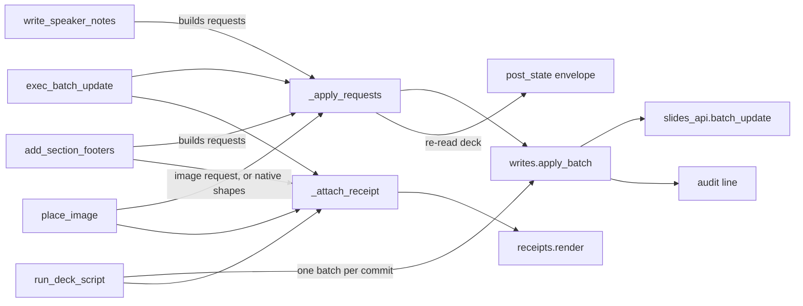

# Write wedge

Five tools, all in `src/slides_mcp/server.py`, and one function that
actually sends: `writes.apply_batch` (`src/slides_mcp/writes.py:88–114`).

`run_deck_script` has its own page, `deck-scripts.md`; this one covers the
other four and the shared helpers.

Line numbers are **a starting point, not an address**. Confirm by what the
code says, and re-date this page if you correct a range.

## `exec_batch_update` (server.py 468–690)

The agent passes Slides API Request dicts; the server forwards them verbatim.
The tool itself only checks `receipt` and chains two steps: `_apply_requests`
(555–656) does everything below and returns the reply plus the touched slides;
`_attach_receipt` (673–690) adds thumbnails. `add_section_footers` and
`write_speaker_notes` and `place_image` call `_apply_requests` directly. In order:

1. Validate `post_state` and non-empty `requests`.
2. Take each request's first key as its kind; intersect with
   `writes.DESTRUCTIVE_KINDS` (`writes.py:20–30`): `deleteObject`, `deleteSlide`, `deleteText`,
   `deleteTableRow`, `deleteTableColumn`, `deleteParagraphBullets`,
   `replaceAllText`, `replaceAllShapesWithImage`,
   `replaceAllShapesWithSheetsChart`.
3. `dry_run=True` returns kinds, the first five requests and the destructive
   kinds found, without calling the API.
4. Destructive kinds without `confirm_destructive=True` return
   `isError: True` with a warning (`_refusal`, 658); **they do not raise**.
5. Call `writes.apply_batch`, which calls `slides_api.batch_update`
   (`slides_api.py:165`). A 403 is re-raised with a hint to re-run
   `slides-mcp-auth` for a write-scope token. Every applied batch writes one
   JSON line to stderr, prefixed `slides-mcp audit `, with the tool, deck id,
   request count and kinds; set `SLIDES_MCP_AUDIT_LOG` to a path to also
   append it to a file (`writes.audit`, 68–77). Separately, every tool call,
   reads included, writes one `slides-mcp call {"tool", "ms", "ok"}` line to
   stderr from the `_CallLog` middleware in `server.py` (`writes.log_call`);
   it never carries arguments or deck content.
6. `post_state="none"` with `receipt="off"` returns now. Otherwise re-read
   the deck **once**, work out the affected slides, and build `deck_outline`
   plus, for `summary`/`full`, a projection of each affected slide. With
   `post_state="none"` the re-read only serves the receipt.

## Receipts (`src/slides_mcp/receipts.py`)

Every slide-changing write returns thumbnails of the slides it touched, so the
agent sees its change without a second call. `exec_batch_update`,
`add_section_footers` and a real `run_deck_script` apply attach one;
`write_speaker_notes` never does (a thumbnail cannot show notes), and neither
does a dry run or a refused write.

- **Which slides.** `affected_slide_ids` below, kept only if the slide still
  exists after the write, in deck order. `run_deck_script`'s `render_slides`
  selector overrides that list (up to 6, its old limit).
- **How many and how big.** `receipt` is `off`, `medium` (default, Google's
  800x450, about 480 tokens) or `large` (1600x900). At most 3 slides are
  rendered; the rest go in `thumbnails.not_shown_slide_ids` with a hint to
  call `render_thumbnail`.
- **Reply shape.** With at least one image, the tool returns a list: the JSON
  body as text, then one image per slide. With none it returns the plain
  dict, as before. The body gains `thumbnails {size, slide_ids,
  not_shown_slide_ids?, hint?, note}`. `note` asks the model to say so if it
  cannot see the images: ChatGPT receives them intact (checked on 2026-10-05,
  an 800x450 PNG byte-identical to `render_thumbnail`'s), yet its model either
  says it cannot read them or invents their contents. `render_thumbnail`
  sends the same line as a text block before its image.
- **Concurrent, each tried once.** `receipts.render` fetches the thumbnails
  in a thread pool, each worker in a copy of the caller's context (HTTP mode
  reads the signed-in caller from it). One after another they added about
  2.3 s per write. A failure, including a `429`, becomes a warning and the
  write still reports success; a `429` is never retried.
- **Shared quota.** Google allows 60 thumbnail requests a minute per user and
  300 per project, shared with `render_thumbnail`. A thumbnail fetched about
  1.35 s after a write already shows it.

In stdio mode each thread builds its own Slides client
(`slides_api._stdio_service`), because the client's HTTP transport is not
thread-safe.

## Size guard and layout warnings (`writes.size_problems`, `layout.py`)

Geometry in requests is EMU, while `read_slides(detail="raw")` reports `at`
in inches. Inches passed as EMU (`w: 3`) are accepted by Google without an
error: it stores its 3,000,000 EMU default square at the tiny translate, so
the box sits at the top-left corner as a 3.281 in square. Checked live on
2026-10-05; a missing magnitude, by contrast, is a 400.

- **Refused before sending.** `writes.size_problems` flags a width or height
  that is not a number or is under 1 pt on `createShape`, `createImage`,
  `createVideo` and `createSheetsChart` (`createLine` is exempt: rules have a
  zero side). `apply_batch` raises on it, `exec_batch_update` returns an
  `isError` reply before its dry run, and `run_deck_script` fails the phase as
  `validation`, dry run included. The `textBox`, `resize` and `move` helpers
  throw the same complaint, located at the script's line.
- **Warned after writing.** `layout.check` runs on the re-read deck against
  the ids the write created (named in requests or assigned in replies) and
  returns one sentence per element at the default square, per group of three
  or more new elements with identical geometry, and per element partly or
  fully off the page. Existing elements are never reported. Without a
  re-read (`post_state="none"` and `receipt="off"`) the reply says the check
  was skipped. A real `run_deck_script` apply reads the deck once more for it.

## `affected_slide_ids` (writes.py 177–225)

Derived from the requests, not reported by Google. It collects slide ids from
`pageObjectId`, `pageObjectIds`, `elementProperties.pageObjectId`, `objectId`
(slide or element), `objectIds` / `childrenObjectIds`, and from
`createSlide` / `duplicateObject` replies. An unscoped `replaceAllText` marks
every slide. Ids are mapped through `deck_model.id_index`, so group children
and speaker-notes shapes map to their slide too. `server._extract_affected_slide_ids`
is a thin wrapper kept for the existing tests.

Element ids are mapped to slides using the deck **as re-read after the
write**. An element the batch deleted is no longer in that deck, so a
`deleteObject` on an element contributes no slide id.

## `add_section_footers` (server.py 703–910)

Turns `[{name, slide_range | slide_ids | slide_positions}]` into four
requests per slide: `createShape` (TEXT_BOX), `insertText`,
`updateShapeProperties` setting `autofit` to `NONE`, then `updateTextStyle`
(9 pt grey). It then calls `_apply_requests`, adds `_proof_tool`,
`sections_applied`, `footers_added` and `skipped_slide_ids`, and attaches the
receipt.

- **Idempotent ids.** Footer objectId is `slides_mcp_footer_` + the last 12
  characters of the slide id. Re-runs find existing footers by that
  prefix and either delete-then-recreate
  (`overwrite_existing=True`, which needs `confirm_destructive=True`) or skip.
- **Fixed geometry.** Position comes from the `_FOOTER_*` constants above the tool, which assume a
  16:9 deck, 10 × 5.625 in. The page size of the actual deck is not read.
- **Autofit order.** The `autofit: NONE` update is emitted after `insertText`
  and before any other shape-property update. The shipped skill
  (`skills/slides-mcp/SKILL.md`) tells agents to do the same in their own
  batches.

## `write_speaker_notes` (server.py 913–985)

Takes `{slide selector: markdown}` and a `mode` of `replace` or `append`,
builds requests with `notes_md.build_requests` (`notes_md.py:224–333`) and
hands them to `_apply_requests`, with no receipt. Markdown is only the input format: `**bold**`
and `*italic*` become run styles, `#`/`##`/`###` become a bold paragraph at
18/16/14 pt (notes have no heading styles), `-` lines become real bullets
nested by two spaces.

- **Bullets go last, last to first.** `createParagraphBullets` nests by
  leading tabs and then deletes them, which shifts every later index. Emitting
  bullet requests after all text and styles, from the end backwards, keeps
  every earlier index valid.
- **Replace clears bullets first.** Deleting all text leaves the paragraph
  bullet behind, and inserted text inherits it, so replace sends
  `deleteParagraphBullets` before `deleteText`.
- **Append un-bullets its own lines.** Text appended after a bulleted
  paragraph inherits the bullet; the builder removes it from the new plain
  lines. That request kind is on the destructive list, but an append that
  contains no `deleteText` only touches text it just inserted, so the tool
  confirms it itself (`notes_md.append_is_safe`, 440).
- `notes_md.apply_to_shape` (335–438) simulates these requests on a notes
  shape. The fake API and the deck-script notes tracking both use it, so the
  round trip `write → read_slides(notes_format="markdown")` is tested without
  the network.

## `place_image` (server.py 1167–1470, `svg_raster.py`, `svg_native.py`)

Puts an SVG or a public image URL on one slide, into a marker placeholder or
an explicit box, as **one** batch through `_apply_requests` (audit tool
name `place_image`), so the audit line, post-state and receipt are the same
as any other write. As an image (the default) in order:

1. Argument checks raise `ValueError`: exactly one of `svg` / `image_url`,
   exactly one of `placeholder` / `box`, `fit` only with a placeholder,
   `editable` only with `svg` and never with `fit="cover"`. A placeholder
   without `confirm_destructive` returns `_refusal` before any read, render
   or upload.
2. In a worker thread (`_place_image`): for SVG, `store.check_image_hosting()`
   fails fast over stdio or with no bucket. Read the deck once; an unknown
   slide is error kind `target`. For a placeholder, find shapes on the slide
   whose text contains the marker; none is error kind `marker` before
   anything is uploaded. The first match's box sets the raster size.
3. SVG: `svg_raster.rasterise` sizes the root `<svg>` to the target box at
   3 px per point (capped at 24 megapixels), so the PNG has the box's aspect
   ratio and the drawing is centred in it. It refuses any `href` that is not
   `#id` or `data:` (resvg would read a local file path). The PNG goes to
   `store.put_image`; Google gets the signed URL.
4. Placeholder: `replaceAllShapesWithImage` with `pageObjectIds=[slide_id]`
   and `CENTER_INSIDE` (`contain`) or `CENTER_CROP` (`cover`). Box:
   `createImage` with size and transform in points.
5. A `SlidesApiError` becomes error kind `google`, with the
   `Invalid requests[0].<kind>: ` prefix stripped.
6. `finally`: the hosted object is deleted on every path after upload. A
   failed delete is a warning; the bucket's lifecycle rule is the backstop.
7. A replace reply without `occurrencesChanged` is error kind `marker`
   (`docs/traps/image-replace-matching-nothing-returns-success.md`).

**Why a child process for resvg.** resvg reports text it dropped for want of
a font only as a log line on file descriptor 1. Over stdio that descriptor is
the MCP transport, and in any mode it is shared by every thread, so the
renderer runs as `python -m slides_mcp.svg_raster`: the child points fd 1 at
its stderr, writes the PNG to the real stdout, and the parent turns `No match
for ... font-family` lines into warnings. It also bounds a slow SVG with a
30 s timeout. A small SVG renders in about 0.06 s, child start included.

### `editable=true`: native shapes (`svg_native.py`, `_place_editable` at server.py 1420)

`svg_native.convert(svg, page_id, box)` turns a subset of SVG into
`createShape` / `createLine` / text-box requests and returns a `Drawing`
(requests, top-level object ids). No hosting, so it works over stdio.
`_place_editable` converts once before reading the deck, so an unsupported
SVG costs no API call; then it finds the target and converts again per box.
A placeholder is `deleteObject` on every shape holding the marker, each
followed by its own drawing in that shape's page bounding box, all in one
batch. The refusal for a placeholder without `confirm_destructive` names
`deleteObject`.

- **One walk, every problem.** `_Builder.walk` builds requests and collects
  each unsupported element, attribute, `style` property, transform, colour
  and zero-size element. Any problem raises `Unsupported` listing them all;
  nothing is sent. The subset is in the tool docstring.
- **Fit.** viewBox to box as `xMidYMid meet`, the same fit `svg_raster`
  gives the raster, so both outputs land in the same place. `g` transforms
  compose as `(sx, sy, tx, ty)`; stroke width and font size scale by the mean
  of `|sx|` and `|sy|`.
- **Fill and outline always written**, `NOT_RENDERED` for none: a bare shape
  gets the theme's fill and outline. An unstroked `line` is skipped.
- **Lines** carry direction in the sign of `scaleX` / `scaleY` with the start
  point as the translate. A marker's single child picks the arrow:
  closed and filled path or polygon is `FILL_ARROW`, otherwise `OPEN_ARROW`;
  circle is `FILL_CIRCLE` or `OPEN_CIRCLE`. No connector binding.
- **Text placement** uses two measured constants because Slides refuses
  `textInsets`: a 7.2 pt inner margin, and the first baseline
  `6.75 + 0.9625 x size` pt below the top of a TOP-aligned box
  (`text_box_top`). `dominant-baseline` `middle`/`central` moves the baseline
  0.35 em down, `hanging` 0.75 em. Box width is 1.6 x an estimate plus margins,
  because a narrow box wraps silently. Fonts go through `font_family`
  (`docs/traps/generic-font-family-renders-as-serif.md`).
- **Grouping.** Two or more elements end with one `groupObjects`; one element
  is left alone (Slides refuses a group of one). Ids are `svg<6 hex>_NNN`
  and `..._grp`, over the 5-character minimum.
- `CUSTOM` is never sent (`docs/traps/custom-shape-type-creates-invisible-shape.md`);
  paths and polygons are refused instead.

## Tests

`tests/unit/test_write_wedge.py` monkeypatches `slides_api` and covers the
destructive guard, dry run, each `post_state` level, the 403 message,
affected-slide extraction and footer request building. Notes writing, the
audit line and the scope check are in `tests/unit/test_deck_script.py`,
which drives the tools against `tests/fake_api.py`. Receipts are in
`tests/unit/test_receipts.py`, over the same fake, which records every
thumbnail asked for and its size and can be told to fail or to block one.
`place_image` is in `tests/unit/test_place_image.py`, over the same fake (it
answers `createImage` and `replaceAllShapesWithImage` like Slides, including
the empty reply) and a `HostedStateStore` whose storage client is a fake GCS
bucket. `tests/unit/test_svg_raster.py` runs the real renderer.
`tests/unit/test_place_image_editable.py` feeds SVG to `place_image(editable=True)`
over the fake and asserts on the recorded requests, one test per supported
element plus rejection, grouping and placeholder cases.
