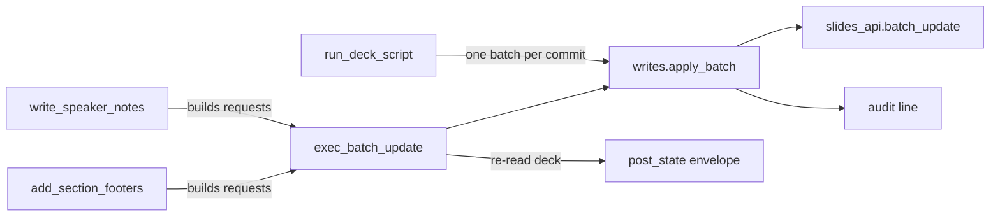

# Write wedge

Four tools, all in `src/slides_mcp/server.py`, and one function that
actually sends: `writes.apply_batch` (`src/slides_mcp/writes.py:88–114`).

`run_deck_script` has its own page, `deck-scripts.md`; this one covers the
other three and the shared helpers.

Line numbers are **a starting point, not an address**. Confirm by what the
code says, and re-date this page if you correct a range.

## `exec_batch_update` (server.py 400–550)

The agent passes Slides API Request dicts; the server forwards them verbatim.
In order:

1. Validate `post_state` and non-empty `requests` (454–461).
2. Take each request's first key as its kind; intersect with
   `writes.DESTRUCTIVE_KINDS` (`writes.py:20–30`): `deleteObject`, `deleteSlide`, `deleteText`,
   `deleteTableRow`, `deleteTableColumn`, `deleteParagraphBullets`,
   `replaceAllText`, `replaceAllShapesWithImage`,
   `replaceAllShapesWithSheetsChart`.
3. `dry_run=True` returns kinds, the first five requests and the destructive
   kinds found, without calling the API (464–473).
4. Destructive kinds without `confirm_destructive=True` return
   `isError: True` with a warning; **they do not raise** (475–485).
5. Call `writes.apply_batch` (488), which calls `slides_api.batch_update`
   (`slides_api.py:165`). A 403 is re-raised with a hint to re-run
   `slides-mcp-auth` for a write-scope token. Every applied batch writes one
   JSON line to stderr, prefixed `slides-mcp audit `, with the tool, deck id,
   request count and kinds; set `SLIDES_MCP_AUDIT_LOG` to a path to also
   append it to a file (`writes.audit`, 68–77). Separately, every tool call,
   reads included, writes one `slides-mcp call {"tool", "ms", "ok"}` line to
   stderr from the `_CallLog` middleware in `server.py` (`writes.log_call`);
   it never carries arguments or deck content.
6. `post_state="none"` returns now. Otherwise re-read the deck **once** and
   build `deck_outline` plus, for `summary`/`full`, a projection of each
   affected slide (491–550).

## `affected_slide_ids` (writes.py 177–225)

Derived from the requests, not reported by Google. It collects slide ids from
`pageObjectId`, `pageObjectIds`, `elementProperties.pageObjectId`, `objectId`
(slide or element), `objectIds` / `childrenObjectIds`, and from
`createSlide` / `duplicateObject` replies. An unscoped `replaceAllText` marks
every slide. Ids are mapped through `deck_model.id_index`, so group children
and speaker-notes shapes map to their slide too. `server._extract_affected_slide_ids`
is a thin wrapper kept for the existing tests.

Element ids are mapped to slides using the deck **as re-read after the
write**. An element the batch deleted is no longer in that deck, so a
`deleteObject` on an element contributes no slide id.

## `add_section_footers` (server.py 552–754)

Turns `[{name, slide_range | slide_ids | slide_positions}]` into four
requests per slide: `createShape` (TEXT_BOX), `insertText`,
`updateShapeProperties` setting `autofit` to `NONE`, then `updateTextStyle`
(9 pt grey). It then calls `exec_batch_update` directly and adds
`_proof_tool`, `sections_applied`, `footers_added` and `skipped_slide_ids`.

- **Idempotent ids.** Footer objectId is `slides_mcp_footer_` + the last 12
  characters of the slide id (658). Re-runs find existing footers by that
  prefix (634–640) and either delete-then-recreate
  (`overwrite_existing=True`, which needs `confirm_destructive=True`) or skip.
- **Fixed geometry.** Position comes from constants at 543–549 that assume a
  16:9 deck, 10 × 5.625 in. The page size of the actual deck is not read.
- **Autofit order.** The `autofit: NONE` update is emitted after `insertText`
  and before any other shape-property update. The shipped skill
  (`skills/slides-mcp/SKILL.md`) tells agents to do the same in their own
  batches.

## `write_speaker_notes` (server.py 756–820)

Takes `{slide selector: markdown}` and a `mode` of `replace` or `append`,
builds requests with `notes_md.build_requests` (`notes_md.py:224–333`) and
hands them to `exec_batch_update`. Markdown is only the input format: `**bold**`
and `*italic*` become run styles, `#`/`##`/`###` become a bold paragraph at
18/16/14 pt (notes have no heading styles), `-` lines become real bullets
nested by two spaces.

- **Bullets go last, last to first.** `createParagraphBullets` nests by
  leading tabs and then deletes them, which shifts every later index. Emitting
  bullet requests after all text and styles, from the end backwards, keeps
  every earlier index valid.
- **Replace clears bullets first.** Deleting all text leaves the paragraph
  bullet behind, and inserted text inherits it, so replace sends
  `deleteParagraphBullets` before `deleteText`.
- **Append un-bullets its own lines.** Text appended after a bulleted
  paragraph inherits the bullet; the builder removes it from the new plain
  lines. That request kind is on the destructive list, but an append that
  contains no `deleteText` only touches text it just inserted, so the tool
  confirms it itself (`notes_md.append_is_safe`, 440).
- `notes_md.apply_to_shape` (335–438) simulates these requests on a notes
  shape. The fake API and the deck-script notes tracking both use it, so the
  round trip `write → read_slides(notes_format="markdown")` is tested without
  the network.

## Tests

`tests/unit/test_write_wedge.py` monkeypatches `slides_api` and covers the
destructive guard, dry run, each `post_state` level, the 403 message,
affected-slide extraction and footer request building. Notes writing, the
audit line and the scope check are in `tests/unit/test_deck_script.py`,
which drives the tools against `tests/fake_api.py`.
